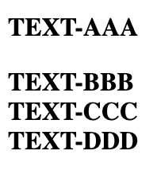

# JSoup Text Reorder Issue

This repository contains a unit test that demonstrates [this](https://github.com/jhy/jsoup/issues/2267) issue logged
with JSoup, whereby after JSoup parses some HTML, some of the elements seem to be reordered.

The test uses [this](src/test/resources/input.html) HTML file as its input. If this file is rendered in Chrome, it looks
as follows:



The text parses this file with JSoup, then gets the parsed document's text, and asserts that it is as expected.

However, the test fails with this:

```
Expected :TEXT-AAA TEXT-BBB TEXT-CCC TEXT-DDD
Actual   :TEXT-AAA TEXT-DDD TEXT-BBB TEXT-CCC
```

Interestingly, the test can be made to pass if any of the `style` attributes in the HTML are removed.

To see the test failing simply run this from the root of the repository:

```shell
./gradlew test
```